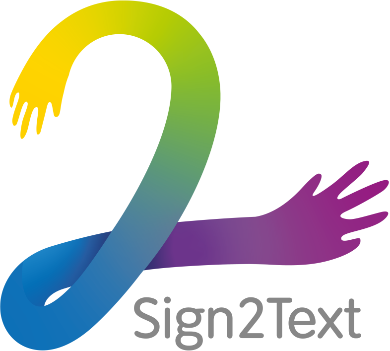

# UBU-Sign2Text

<div align="center">
  
  <br />
  <br />
  Transcripción de lenguaje de signos (a nivel de palabra) mediante Deep Learning
  <br />
  <br />
  
</p>

---

## Índice de contenido

- [UBU-Sign2Text](#ubu-sign2text)
  - [Índice de contenido](#índice-de-contenido)
  - [Instalación](#instalación)
    - [Instalamos el paquete de entorno virtual](#instalamos-el-paquete-de-entorno-virtual)
    - [Creamos un entorno virtual](#creamos-un-entorno-virtual)
    - [Activamos el entorno virtual](#activamos-el-entorno-virtual)
    - [Instalamos los paquetes necesarios](#instalamos-los-paquetes-necesarios)
    - [Instalamos PyTorch compatible con CUDA](#instalamos-pytorch-compatible-con-cuda)
  - [Próximo dataset a probar](#próximo-dataset-a-probar)

## Instalación

Se usa un entorno virtual de Python para la ejecución de este programa.

Esto se puede hacer del siguiente modo:

### Instalamos el paquete de entorno virtual

```bash
pip install virtualenv
```

### Creamos un entorno virtual

```bash
virtualenv venv
```

### Activamos el entorno virtual

> Linux:

```bash
source venv/bin/activate
```

> Windows:

```bash
./venv/Scripts/activate
```

### Instalamos los paquetes necesarios

```bash
pip install -r requirements.txt
```

### Instalamos PyTorch compatible con CUDA

Esto nos instalará los binarios de CUDA y CuDNN.

```bash
pip install torch==1.10.2+cu113 torchvision==0.11.3+cu113 torchaudio===0.10.2+cu113 -f https://download.pytorch.org/whl/cu113/torch_stable.html
```

## Próximo dataset a probar

<https://how2sign.github.io/#download>

<https://www.youtube.com/watch?v=C3xZUdZ6WsY>
